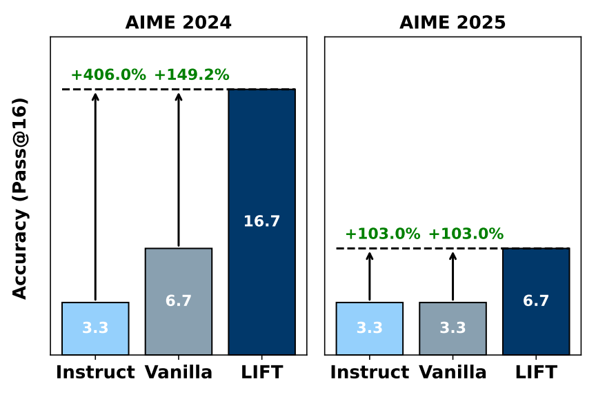
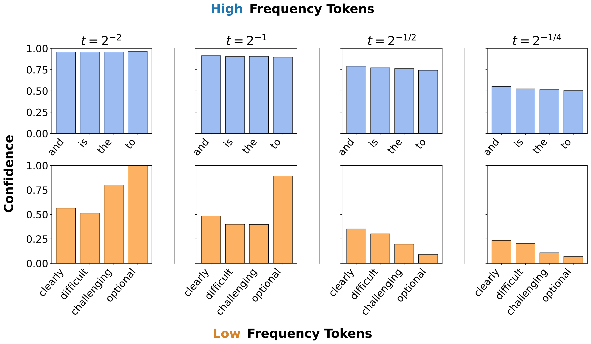

<div align="center">
  <h1>Learnability-Informed Fine-Tuning for Diffusion Language Models</h1>
  <p>Code for supervised fine tuning and evaluating diffusion LLMs with Learnability-Informed Fine-Tuning (LIFT).</p>
  <p>
    <strong>📄 Paper</strong> &nbsp;|&nbsp;
    <strong>🤗 Hugging Face</strong> 
  </p>
</div>

<div align="center">
  
  
</div>


<div align="center">
  <hr width="100%">
</div>

## 📰 Updates

- **April 2026**: Accepted to ICML 2026! 🔥

## 🗂️ Repository Layout

```text
scripts/   launch scripts
SFT/       fine-tuning and LoRA merge
eval/      evaluation, generation, and scoring
dataset/   local datasets (countdown/sudoku/AIME JSONs)
```

## ⚙️ Environment Setup

```bash
conda env create -f lift.yml
conda activate lift
```

## 🧪 SFT

Run SFT with the root launcher:

```bash
bash scripts/sft/run_sft.sh
```

Merge LoRA adapters for standalone evaluation checkpoints:

```bash
python SFT/merge_lora.py \
  --base_model GSAI-ML/LLaDA-8B-Instruct \
  --adapter_path SFT/sft_output/<run>/checkpoint-<step> \
  --output_path SFT/merged_models/<run>/checkpoint-<step> \
  --architecture llada
```

Use `--architecture llada` for checkpoints that will be evaluated with this repo's LLaDA evaluation code. The script reads `base_model_name_or_path` from the adapter config when available; `--base_model` is used as the fallback.

## 📊 Evaluation

Run evaluation with:

```bash
bash scripts/eval/run_eval.sh
```

The eval runner prints accuracy when generation finishes and writes the score into each generation JSON.

Supported `--dataset` keys in `eval/eval.py`:

`gsm8k`, `math500`, `countdown`, `sudoku`, `aime24`, `aime25`, `humaneval`, `mbpp`


## 📚 Module Docs

- `SFT/README.md` for training methods, datasets, and SFT scripts
- `eval/README.md` for evaluation workflow and task details

## 📄 License

MIT License

Copyright (c) 2026 The Authors

Permission is hereby granted, free of charge, to any person obtaining a copy
of this software and associated documentation files (the “Software”), to deal
in the Software without restriction, including without limitation the rights
to use, copy, modify, merge, publish, distribute, sublicense, and/or sell
copies of the Software, and to permit persons to whom the Software is
furnished to do so, subject to the following conditions:

The above copyright notice and this permission notice shall be included in all
copies or substantial portions of the Software.

THE SOFTWARE IS PROVIDED “AS IS”, WITHOUT WARRANTY OF ANY KIND, EXPRESS OR
IMPLIED, INCLUDING BUT NOT LIMITED TO THE WARRANTIES OF MERCHANTABILITY,
FITNESS FOR A PARTICULAR PURPOSE AND NONINFRINGEMENT. IN NO EVENT SHALL THE
AUTHORS OR COPYRIGHT HOLDERS BE LIABLE FOR ANY CLAIM, DAMAGES OR OTHER
LIABILITY, WHETHER IN AN ACTION OF CONTRACT, TORT OR OTHERWISE, ARISING FROM,
OUT OF OR IN CONNECTION WITH THE SOFTWARE OR THE USE OR OTHER DEALINGS IN THE
SOFTWARE.
